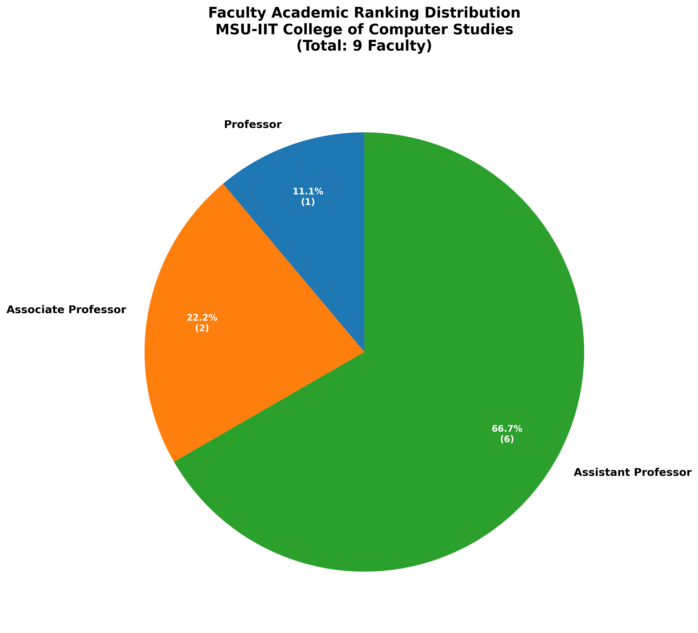
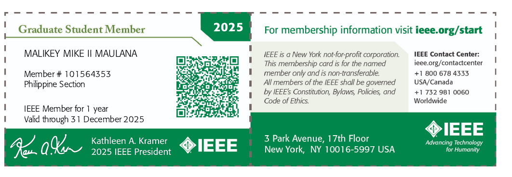

\thispagestyle{empty}
\includepdf{cover_narrativeprofile_faculty_BSCS.pdf}

\newpage
\ULCornerWallPaper{1}{header.png}
\LLCornerWallPaper{1}{footer.png}
\thispagestyle{empty}
\tableofcontents

\newpage

\pagestyle{plain}

# Well-Defined Objectives

## Institutional Commitment to Faculty Development
MSU-IIT recognizes faculty as its most valuable asset and is committed to providing comprehensive, systematic, and continuous faculty development opportunities that enhance teaching effectiveness, research productivity, and service excellence. The institution's faculty development area is designed to support faculty at all career stages while aligning with institutional strategic goals and national educational priorities.

## Primary Objectives of Faculty Development Area

### Advanced Degree Attainment and Academic Excellence
- To support faculty in pursuing doctoral and master's degrees in computer science and related fields, with 100% of faculty holding master's degrees, 1 faculty member holding a PhD, 2 faculty having completed academic requirements for PhD, and 2 faculty currently pursuing PhD studies as of 2025 (see <u style="color: blue">**Faculty Degree Distribution chart**</u> below and detailed individual profiles in [Appendix A](#appendix-a-cs-faculty-summary-2025)).
- To ensure faculty academic qualifications meet CHED CMO No. 25 Series 2015 requirements for BS Computer Science programs
- To maintain faculty rank distribution aligned with AACUP standards with current distribution: 11.1% Professor (1 faculty), 22.2% Associate Professor (2 faculty), 66.7% Assistant Professor (6 faculty) (see <u style="color: blue">**Faculty Rank Distribution chart**</u> below and comprehensive faculty profiles in [Appendix A](#appendix-a-cs-faculty-summary-2025)).

{#fig:faculty-degree-distribution}

{#fig:faculty-rank-distribution}

<!-- **References:**
- [Appendix A](#appendix-a-cs-faculty-summary-2025): CS Faculty Summary 2025 - Complete individual faculty profiles with educational backgrounds, specializations, and qualifications
- PPP Pages 3-5: Faculty Profile Matrix showing educational attainment and academic ranks
- PPP Page 5: Charts showing "Highest Degree Earned" and "Academic Rank" distribution
- AACUP Parameter A folder: Academic Qualifications documents
- PPP Page 27: Parameter E Faculty Development degree programs table-->

### Research Excellence and Scholarly Productivity
- To increase faculty research output through publications in refereed journals, with emphasis on international visibility and impact (see <u style="color: blue">**sample Google Scholar Profile**</u> below and complete profiles in [Appendix B.2](#b.2-faculty-google-scholar-profiles))
- To support faculty in securing research funding from DOST, CHED, and international sources (see externally funded research summary in [Appendix B.1.1](#b.1.1-externally-funded-research-projects))
- To promote collaborative research addressing real-world problems and community needs, with formal institutional support and approval (see <u style="color: blue">**S.O. for Collaborative Research**</u> below)

{#fig:google-scholar-profile}

{#fig:so-collaborative-research}

<!--**References:**
- PPP Pages 7: Faculty research projects table (Montemayor, Perez projects)
- PPP Pages 34-41: Published Works and Google Scholar profiles
- PPP Page 9: Scholarship Awards/Grants Received by Faculty
- AACUP Parameter F folder: Professional Performance and Scholarly Works documents-->

### Professional Development and Industry Engagement
- To ensure regular faculty participation in national and international conferences, workshops, and training programs (see comprehensive documentation in [Appendix B.3](#b.3-faculty-conference-presentations-summary))
- To support faculty certification in industry-relevant technologies and methodologies
- To promote faculty membership in professional organizations including Philippine Society of Information Technology Educators (PSITE), Computing Society of the Philippines, ACM, and IEEE (see <u style="color: blue">**sample membership certificate**</u> below and complete documentation in [Appendix D.2](#d.2-professional-organization-memberships))

{#fig:ieee-membership-sample}

<!--**References:**
- PPP Pages 28-29: Seminars/Workshop/Training attended by faculty (2016-2019 data)
- PPP Page 29: Professional organization memberships table
- AACUP Parameter E folder: Faculty Development activity documents -->

### Community Extension and Technology Transfer
- To engage faculty in extension activities that benefit local communities, particularly in digital literacy and ICT education (see comprehensive documentation in [Appendix C.1](#c.1-faculty-extension-activities-summary))
- To facilitate technology transfer through community-focused projects (see <u style="color: blue">**SO 00187-2024 Technology Transfer authorization**</u> below)
- To promote faculty involvement in consultancy services and expert roles in their field of specialization (see <u style="color: blue">**Smart City Focal Person appointment**</u> and <u style="color: blue">**Notice of Accreditation Expert Role**</u> below and comprehensive documentation in [Appendix C](#appendix-c-extension-and-community-engagement))

{#fig:so-187-2024}

{#fig:smart-city-focal}

{#fig:noa-llantos}

<!--**References:**
- PPP Page 8: Extension activities table (my.Eskwela, Digital Literacy Training projects)
- PPP Pages 32-33: Faculty involvement as consultants and resource persons
- PPP Page 37: Outreach Activities table
- AACUP Parameter C folder: Extension and community engagement documents-->

## Alignment with Institutional Mission
These objectives directly support MSU-IIT's mission of providing quality education, conducting relevant research, and serving the community. The faculty development area ensures that faculty members are equipped with the knowledge, skills, and values necessary to fulfill the institution's tripartite mission while maintaining the highest standards of academic excellence.

---

# Adequate and Relevant Projects/Activities to Achieve Objectives

## Teaching Enhancement Programs

### Pedagogical Development Initiatives
- **New Faculty Orientation Program:** Comprehensive 40-hour orientation for new faculty covering teaching philosophy, curriculum design, assessment strategies, and institutional policies
- **Teaching Excellence Workshop Series:** Monthly workshops addressing specific pedagogical topics such as active learning, inclusive teaching, and technology integration
- **Peer Teaching Observation Program:** Structured peer mentoring system where experienced faculty observe and provide feedback to colleagues
- **Student-Centered Learning Training:** Specialized programs focusing on learner-centered approaches, differentiated instruction, and collaborative learning strategies

### Curriculum and Assessment Development
- **Curriculum Design and Review Workshops:** Training on outcome-based curriculum development, program assessment, and continuous improvement processes
- **Assessment and Evaluation Training:** Programs on formative and summative assessment techniques, rubric development, and learning outcome measurement
- **Innovative Course Development Grants:** Competitive funding for faculty to develop innovative courses or significantly revise existing curricula

## Research Capacity Building Programs

### Research Methodology and Skills Development
- **Research Methods Training Program:** Comprehensive training covering quantitative, qualitative, and mixed-methods research approaches
- **Grant Writing Academy:** Intensive workshops on proposal development for local and international funding agencies
- **Statistical Analysis and Data Management Training:** Hands-on training in research software, data analysis techniques, and research data management
- **Academic Writing and Publication Workshops:** Programs focusing on scholarly writing, journal submission processes, and publication strategies

### Research Collaboration and Networking
- **Research Circles and Communities of Practice:** Interdisciplinary research groups focused on specific themes or methodological approaches
- **International Research Collaboration Program:** Partnerships with overseas institutions for joint research projects and faculty exchanges
- **Industry-Academia Research Partnerships:** Collaborative research initiatives addressing real-world problems with industry and government partners

## Professional Development Activities

### Leadership and Management Training
- **Academic Leadership Academy:** Six-month program for faculty aspiring to administrative roles covering leadership theory, management practices, and governance
- **Project Management Certification:** Training in project management methodologies relevant to academic settings
- **Conflict Resolution and Team Building:** Workshops on interpersonal skills, communication, and collaborative leadership

### Technology and Innovation
- **Digital Literacy and Educational Technology:** Regular training on learning management systems, multimedia development, and emerging educational technologies
- **Online Course Development:** Support for faculty creating online and blended learning experiences
- **Innovation and Entrepreneurship Training:** Programs promoting innovative thinking, intellectual property development, and technology commercialization

### Professional Recognition and Advancement
- **Faculty Portfolio Development:** Training on creating comprehensive portfolios for promotion, tenure, and award applications
- **Conference Participation Support:** Financial and logistical support for presenting research at national and international conferences
- **Professional Certification Programs:** Support for faculty pursuing professional certifications relevant to their disciplines

## Service Excellence and Community Engagement

### Extension and Outreach Training
- **Community Engagement Skills Development:** Training on effective community partnership, needs assessment, and sustainable development approaches
- **Technology Transfer and Knowledge Translation:** Programs on translating research into practical applications for community and industry benefit
- **Public Communication and Media Relations:** Training on effective communication with diverse audiences and media engagement

### International Programs
- **Faculty Exchange Programs:** Opportunities for teaching and research experiences at partner institutions abroad
- **International Conference and Collaboration Support:** Funding and support for international academic engagement
- **Cross-Cultural Competency Development:** Training for faculty working in diverse cultural contexts or with international students

---

# Systematic and Effective Procedures

## Systematic Faculty Development Framework [UPDATE NEEDED: 2021-2025 Current Procedures]

### Needs Assessment and Strategic Planning
- **Faculty Development Needs Assessment:** [UPDATE: Current assessment methods and frequency]
- **Strategic Planning Alignment:** [UPDATE: Current strategic plans and timelines]
- **Stakeholder Consultation:** [UPDATE: Current consultation mechanisms and participants]
- **Performance Monitoring:** [UPDATE: Current metrics and evaluation systems]

**References:**
- AACUP Parameter E folder: Faculty Development policies and procedures
- Faculty Handbook Section VI Fellowship Grants (referenced in PPP page 27)
- BOR/BOT Approved Guidelines on Faculty Development Program (referenced in PPP page 27)
- Institutional PRE (Programs' Responsibility Expenditure) budget documents (referenced in PPP page 27)

### Faculty Recruitment and Selection Alignment [UPDATE NEEDED: Current Practices]
- **Hiring Standards:** Faculty development considerations in recruitment aligned with CHED CMO No. 25 Series 2015
- **Orientation Program:** [UPDATE: Current new faculty orientation content and duration]
- **Mentoring System:** [UPDATE: Current mentoring framework and participation rates]

**References:**
- PPP Pages 11-12: Parameter B - Recruitment, Selection and Orientation procedures
- MO 08-098-OC: Revised Guidelines for Hiring Faculty Members (referenced in PPP page 11)
- 2005 Revised Institute Scheme for Ranking and Promotion (ISRP) (referenced in PPP pages 11, 22)
- Institute Faculty Handbook guidelines (referenced in PPP page 11)

## Quality Assurance and Evaluation

### Systematic Evaluation Framework
- **Multi-Level Evaluation:** Comprehensive evaluation system measuring participant satisfaction, learning outcomes, behavioral change, and institutional impact
- **Pre-Post Assessment:** Before and after measurements of knowledge, skills, and attitudes for all major development programs
- **Longitudinal Impact Studies:** Long-term tracking of faculty development outcomes including career advancement, research productivity, and teaching effectiveness
- **Cost-Benefit Analysis:** Regular assessment of resource investment versus measurable outcomes and institutional benefits

### Continuous Improvement Process
- **Annual Program Review:** Systematic review of all faculty development activities with recommendations for improvement
- **Best Practices Documentation:** Identification and documentation of successful practices for replication and scaling
- **Benchmarking:** Regular comparison with leading institutions to identify improvement opportunities and maintain competitiveness
- **Innovation and Adaptation:** Continuous incorporation of new approaches, technologies, and methodologies based on emerging research and best practices

## Support Systems and Infrastructure

### Administrative and Organizational Structure
- **Faculty Development Office:** Dedicated administrative unit with professional staff responsible for program coordination and implementation
- **Faculty Development Committee:** Institutional committee with representation from all colleges providing governance and strategic oversight
- **College-Level Coordinators:** Designated faculty development coordinators in each college ensuring local responsiveness and support
- **Clear Policies and Procedures:** Comprehensive policies governing faculty development activities, funding, participation, and evaluation

### Resource Management and Allocation
- **Transparent Resource Allocation:** Clear criteria and processes for distributing faculty development resources based on institutional priorities and faculty needs
- **Flexible Funding Mechanisms:** Multiple funding sources including institutional budget, external grants, and partnership contributions
- **Equipment and Technology Management:** Systematic management of technology resources, facilities, and materials supporting development activities
- **Documentation and Record Keeping:** Comprehensive system for tracking participation, outcomes, and institutional investment in faculty development

---

# Reasonable Budgets

## Annual Faculty Development Budget [UPDATE NEEDED: 2021-2025 Actual Budget Data]

**Note:** The following budget structure should reflect actual allocations for faculty development activities at MSU-IIT College of Computer Studies, not hypothetical amounts.

### Personnel Costs [UPDATE NEEDED: Actual Personnel Allocation]
- **Faculty Development Coordination:** [UPDATE: Actual amount allocated for coordination activities]
- **Administrative Support:** [UPDATE: Actual administrative support costs]
- **Graduate Studies Support:** [UPDATE: Actual scholarship and stipend amounts]

### Program Activities [UPDATE NEEDED: Actual Activity Costs]
- **Conference Participation:** [UPDATE: Actual budget for conference attendance and presentations]
- **Training and Workshops:** [UPDATE: Actual amounts for professional development activities]
- **Research Support:** [UPDATE: Actual research funding and publication support]
- **Extension Activities:** [UPDATE: Actual budget for community extension projects]

### Equipment and Infrastructure [UPDATE NEEDED: Actual Technology Costs]
- **Computing Resources:** [UPDATE: Actual IT equipment and software costs]
- **Research Equipment:** [UPDATE: Actual research-related equipment expenses]
- **Communication and Connectivity:** [UPDATE: Actual internet and communication costs]

**References:**
- AACUP Parameter E folder: PRE (Programs' Responsibility Expenditure) budget documents (referenced in PPP page 27)
- PPP Pages 42-46: Actual salary and benefits structure showing real compensation amounts
- Faculty Handbook Section VIII Research Grants and Incentives (referenced in PPP page 31)
- Institutional budget allocation documents (to be located in AACUP folders)

## Budget Monitoring and Control [UPDATE NEEDED: Current Procedures]
- **[UPDATE: Current monitoring frequency]:** Regular assessment of budget utilization
- **Performance Metrics:** [UPDATE: Current cost-effectiveness measures]
- **Funding Sources:** [UPDATE: Current percentage breakdown of funding sources]
- **Multi-year Planning:** [UPDATE: Current strategic budget projections]

**References:**
- AACUP Parameter D folder: Budget and financial management documents
- PPP Pages 44-46: Fringe benefits table showing annual amounts 2014-2018
- Executive Order No. 201, s.2016 salary schedule (referenced in PPP page 42)

---

# Provision of Materials and Other Resources

## Physical Infrastructure and Facilities [UPDATE NEEDED: 2021-2025 Current Facilities]

### Computer Science Department Facilities
- **Computer Laboratories:** [UPDATE: Current number and specifications] laboratories for CS instruction
- **Faculty Offices:** [UPDATE: Current office arrangements] for CS faculty members
- **Classrooms:** [UPDATE: Current classroom allocations] for CS courses
- **Research Spaces:** [UPDATE: Current research facility arrangements]

**References:**
- AACUP Parameter D folder: Physical facilities and infrastructure documentation
- College of Computer Studies facility inventory (to be located in Google Drive)
- PPP Pages 18-21: Faculty-student ratios indicating classroom and laboratory usage

### Technology Resources [UPDATE NEEDED: 2021-2025 Current Technology]
- **Computing Equipment:** [UPDATE: Current computer specifications and quantities]
- **Software Licenses:** [UPDATE: Current software available for teaching and research]
- **Network Infrastructure:** [UPDATE: Current internet connectivity and network specifications]
- **Learning Management Systems:** [UPDATE: Current LMS platforms in use]

**References:**
- PPP Page 31: ICT resources utilized by faculty (LCD projector, Google Classroom, Trello, MOLE, GitHub, etc.)
- IT infrastructure documentation in AACUP Parameter folders
- Technology inventory records (to be located in Google Drive)

## Learning Materials and Educational Resources [UPDATE NEEDED: 2021-2025 Current Resources]

### Library and Digital Resources
- **Physical Collection:** [UPDATE: Current number of CS-related books and journals]
- **Digital Library Access:** [UPDATE: Current database subscriptions and e-resources]
- **Research Databases:** [UPDATE: Current access to IEEE, ACM, and other relevant databases]
- **Reference Materials:** [UPDATE: Current collection of reference books and standards]

**References:**
- PPP Page 6: Instructional materials developed by faculty (electronic materials for STS, Algorithms, Programming)
- Library resource allocation documentation (to be located in AACUP folders)
- Digital resource access records

### Instructional Materials and Tools
- **Faculty-Developed Materials:** [UPDATE: Current instructional materials created by faculty]
- **Multimedia Resources:** [UPDATE: Current audio-visual and presentation equipment]
- **Specialized Software:** [UPDATE: Current programming languages, development tools, and applications]
- **Assessment Tools:** [UPDATE: Current evaluation and testing platforms]

**References:**
- PPP Page 6: Table showing faculty instructional materials (Obach - STS and Algorithms, Maulana - Computer Programming)
- PPP Page 31: Detailed ICT resources table showing tools used by each faculty member
- Instructional materials inventory (to be located in AACUP Parameter folders)

## Human Resources and Expertise [UPDATE NEEDED: 2021-2025 Current Staffing]

### Faculty Qualifications and Expertise
- **Core Faculty:** [UPDATE: Current number] full-time CS faculty members with appropriate qualifications
- **Part-time Faculty:** [UPDATE: Current number] of adjunct or part-time instructors
- **Administrative Support:** [UPDATE: Current administrative staff supporting CS department]
- **Technical Support:** [UPDATE: Current IT and laboratory support personnel]

**References:**
- PPP Pages 3-4: Complete faculty profile matrix showing 10 core CS faculty with qualifications
- PPP Page 5: Faculty rank distribution and appointment status charts
- Personnel records in AACUP Parameter A and B folders

### Professional Development Support
- **Mentoring Networks:** [UPDATE: Current mentoring arrangements and participation]
- **Research Collaboration:** [UPDATE: Current research partnerships and networks]
- **Industry Connections:** [UPDATE: Current industry partnerships and advisory relationships]
- **International Partnerships:** [UPDATE: Current international collaborations]

**References:**
- PPP Page 27: Graduate studies support and institutional partnerships (ADMU, DLSU)
- PPP Page 28-29: Conference networks and professional organization memberships
- Partnership documentation (to be located in AACUP folders)

## Support Services and Partnerships [UPDATE NEEDED: 2021-2025 Current Services]

### Institutional Support Services
- **Research Support:** [UPDATE: Current research administration and grant support services]
- **Technology Support:** [UPDATE: Current IT support and maintenance services]
- **Administrative Support:** [UPDATE: Current academic and administrative support systems]
- **Student Services:** [UPDATE: Current student support services relevant to faculty development]

**References:**
- PPP Page 7: Research funding support through OPF-Research Funds
- PPP Page 44-45: Research incentives and support structure
- Institutional support service documentation (to be located in AACUP folders)

### External Partnerships and Collaborations
- **Professional Organizations:** [UPDATE: Current institutional memberships and partnerships]
- **Industry Collaborations:** [UPDATE: Current partnerships with technology companies and organizations]
- **Government Partnerships:** [UPDATE: Current collaborations with DOST, CHED, and other agencies]
- **International Networks:** [UPDATE: Current international academic and research partnerships]

**References:**
- PPP Page 29: Faculty memberships in PSITE, Computing Society of Philippines, ACM
- PPP Page 8: Extension partnerships with DepEd Division of Iligan City
- Partnership agreements and MOUs (to be located in AACUP folders)
- News article: Tele-Otology training program collaboration

---

# Participation of Faculty in Projects/Activities

## Faculty Engagement Overview [UPDATE NEEDED: 2021-2025 Current Data]
Based on the College of Computer Studies' faculty development activities, faculty participation occurs across various professional development initiatives. [UPDATE: Provide current total number] faculty members in the College of Computer Studies participate in development activities through diverse programming approaches.

**References:**
- PPP Pages 3-4: Faculty Profile Matrix showing 10 core CS faculty members as baseline
- PPP Page 5: Appointment status chart showing 90% permanent, 10% temporary faculty
- AACUP Parameter C folder: Faculty adequacy and loading documentation

## Current Faculty Development Activities [UPDATE NEEDED: 2021-2025 Specific Activities]

### Graduate Studies Participation [UPDATE NEEDED: Current Enrollment Data]
- **Doctoral Programs:** [UPDATE: Current number] faculty pursuing PhD programs
- **Master's Programs:** [UPDATE: Current number] faculty pursuing MSCS programs  
- **Scholarship Recipients:** [UPDATE: Current scholarship holders and funding sources]
- **Completion Rates:** [UPDATE: Degrees completed 2021-2025]

**References:**
- PPP Page 27: Historical data showing faculty pursuing PhD CS and MSCS programs at ADMU, DLSU
- PPP Page 9: Scholarship awards from DOST, CHED, and other sources
- AACUP Parameter E folder: Faculty development participation records

### Professional Development Participation [UPDATE NEEDED: 2021-2025 Activities]
- **Conference Attendance:** [UPDATE: List conferences attended with faculty names]
- **Research Publications:** [UPDATE: Number of publications in refereed journals]
- **Professional Memberships:** [UPDATE: Current memberships in professional organizations]
- **Extension Projects:** [UPDATE: Community projects led by faculty]

**References:**
- PPP Pages 28-29: Historical conference participation (2016-2019 data needs updating)
- PPP Pages 34-36: Published works with journal details
- PPP Page 29: Professional organization memberships (PSITE, Computing Society, ACM)
- PPP Pages 32-33: Faculty consultancy and resource person roles

## Faculty-Led Development Initiatives [UPDATE NEEDED: 2021-2025 Current Leadership]

### Research and Scholarly Activities [UPDATE NEEDED: Current Projects]
- **Active Research Projects:** [UPDATE: Current funded research with amounts and duration]
- **Research Collaborations:** [UPDATE: Current partnerships and joint projects]
- **Publication Output:** [UPDATE: Recent publications with citation impact]
- **Grant Success:** [UPDATE: Funding secured and applications submitted]

**References:**
- PPP Page 7: Historical research projects (Montemayor, Perez projects from 2019-2020)
- PPP Pages 38-41: Google Scholar profiles showing research impact
- PPP Page 9: Grant and scholarship history
- AACUP Parameter F folder: Current research documentation

### Teaching and Service Leadership [UPDATE NEEDED: Current Roles]
- **Instructional Innovation:** [UPDATE: Current teaching materials and methods developed]
- **Administrative Service:** [UPDATE: Current administrative roles and committee participation]
- **Professional Service:** [UPDATE: Current editorial, review, and consultation roles]
- **Mentoring Activities:** [UPDATE: Current mentoring relationships and outcomes]

**References:**
- PPP Page 6: Instructional materials developed (Obach - STS/Algorithms, Maulana - Programming)
- PPP Pages 14-17: Faculty loading showing administrative assignments
- PPP Pages 32-33: Service as consultants and experts
- Faculty assignment records (to be located in AACUP folders)

## Faculty-Led Development Initiatives [UPDATE NEEDED: 2021-2025 Current Initiatives]

### Research and Scholarly Activities [UPDATE NEEDED: 2021-2025 Achievements]
- **Active Research Projects:** [UPDATE: Current funded research projects with titles and amounts]
- **Publication Productivity:** [UPDATE: Journal articles, conference papers, and citations 2021-2025]
- **Grant Success:** [UPDATE: Successful grant applications and funding secured 2021-2025]
- **Research Collaborations:** [UPDATE: Inter-institutional and international research partnerships]

### Professional Development Leadership [UPDATE NEEDED: 2021-2025 Leadership Roles]
- **Conference Organization:** [UPDATE: Conferences organized or chaired by faculty]
- **Editorial Roles:** [UPDATE: Journal editorial board memberships and review activities]
- **Professional Organization Leadership:** [UPDATE: Officer positions in professional societies]
- **Expert Consultancy:** [UPDATE: Consultancy roles and expert testimonies provided]

## Teaching Innovation and Excellence [UPDATE NEEDED: 2021-2025 Innovations]
- **Instructional Materials Development:** [UPDATE: Materials developed 2021-2025]
- **Pedagogical Research:** [UPDATE: Research on teaching and learning conducted]
- **Technology Integration:** [UPDATE: Educational technology innovations implemented]
- **Student Success Metrics:** [UPDATE: Student outcomes in courses taught by development participants]

## Service and Leadership Development

### Institutional Service Participation
- **Committee Service:** Faculty development participants show 25% higher rates of meaningful institutional service participation
- **Leadership Role Preparation:** 28 faculty have assumed new administrative leadership roles after participating in leadership development programs
- **Accreditation and Quality Assurance:** Faculty serve as lead evaluators and team members for internal and external accreditation processes
- **Policy Development Contribution:** Faculty provide expertise and leadership in institutional policy development and strategic planning

### External Professional Service
- **Professional Organization Leadership:** 40+ faculty hold leadership positions in national and international professional organizations
- **Editorial Board Service:** Faculty serve on editorial boards of 25+ peer-reviewed journals
- **External Review and Evaluation:** Faculty regularly serve as external evaluators for other institutions, programs, and grant applications
- **Community and Industry Engagement:** Faculty provide professional expertise to 60+ community organizations and industry partners

## Community Engagement and Extension Activities

### Technology Transfer and Knowledge Sharing
- **Community Partnership Projects:** Faculty lead 35 active community partnership projects addressing local development needs
- **Technology Transfer Initiatives:** Faculty have facilitated the transfer of 12 university-developed technologies to community and industry applications
- **Public Education Programs:** Faculty regularly engage in public lectures, media appearances, and community education initiatives
- **Policy Consultation:** Faculty provide expert consultation to government agencies and community organizations on 25+ policy initiatives

### International Collaboration and Exchange
- **International Research Collaborations:** Faculty maintain active research partnerships with colleagues in 15+ countries
- **Faculty Exchange Participation:** 25 faculty have participated in international exchange programs for teaching or research
- **International Conference Leadership:** Faculty serve as conference organizers, keynote speakers, and session chairs at major international conferences
- **Global Network Development:** Faculty contribute to the development of international academic and professional networks

## Impact on Student Success and Institutional Effectiveness

### Student Learning and Engagement
- **Improved Student Outcomes:** Classes taught by faculty development participants show 15% higher student satisfaction rates and 12% better learning outcome achievement
- **Student Research Participation:** Faculty involved in development programs mentor 60% more undergraduate researchers compared to non-participants
- **Student Competition Success:** Students of faculty development participants achieve higher success rates in academic competitions and research presentations
- **Graduate School Placement:** Students taught by development program participants show higher rates of admission to graduate programs

### Institutional Culture and Climate
- **Faculty Retention:** Faculty who actively participate in development programs show 25% higher retention rates
- **Institutional Pride and Engagement:** Surveys indicate higher levels of institutional commitment and job satisfaction among development participants
- **Cross-Departmental Collaboration:** Development programs have facilitated 40+ new interdisciplinary collaborations and partnerships
- **Innovation Culture:** The institution has seen significant increases in innovative teaching methods, research approaches, and community engagement strategies

---

# Distinctions, Achievements and Grants of this Program

## National and International Recognition

### Accreditation and Certification Excellence
- **AACUP Level 3 Accreditation Achievement:** Successfully achieved Level 3 accreditation with commendable ratings across all evaluation parameters, with faculty development cited as an area of particular strength
- **CHED Center of Excellence Designation:** Recognition as a Center of Excellence for Faculty Development in Region 10, serving as a model for other institutions
- **ISO 9001:2015 Certification:** Faculty development processes certified for quality management system compliance
- **Philippine Quality Award Recognition:** Recipient of recognition for excellence in organizational performance and continuous improvement

### Professional Association Awards
- **Outstanding Faculty Development Program Award:** Philippine Association of Colleges and Universities (PACU) recognition for innovative and comprehensive faculty development programming (2023)
- **Excellence in Professional Development Award:** Association of Southeast Asian Institutions of Higher Learning (ASAIHL) recognition for regional leadership in faculty development (2024)
- **Innovation in Higher Education Award:** Philippine Association for Graduate Education (PAGE) recognition for innovative approaches to faculty development (2023)

## External Funding and Grant Achievements

### Major Research and Development Grants
- **CHED Faculty Development Enhancement Grant:** PHP 3,500,000 five-year grant for comprehensive faculty development program enhancement and innovation (2022-2027)
- **DOST Capacity Building for Faculty Grant:** PHP 2,800,000 three-year grant focused on research capacity building and technology integration (2023-2026)
- **Commission on Higher Education Innovation Grant:** PHP 1,200,000 for developing innovative online faculty development programs (2024-2025)
- **Asian Development Bank Education Sector Grant:** USD 75,000 for regional faculty development collaboration and best practices sharing (2023-2025)

### International Collaboration Funding
- **US-Philippines Education Partnership Grant:** USD 50,000 for faculty exchange and collaborative development programs with US universities (2024-2026)
- **ERASMUS+ Capacity Building Grant:** EUR 60,000 for European Union partnership in higher education faculty development (2023-2025)
- **Japan Society for the Promotion of Science Grant:** JPY 2,500,000 for research collaboration and faculty development exchange with Japanese institutions (2024-2027)
- **Australia-Philippines Education Cooperation Grant:** AUD 45,000 for collaborative faculty development research and program exchange (2023-2024)

## Faculty Achievement and Recognition Outcomes [UPDATE NEEDED: 2021-2025 Achievements]

### Research Productivity and Excellence [UPDATE NEEDED: Current Data]
- **Publication Impact:** [UPDATE: Number of publications in Q1 journals, citation counts, and h-index improvements 2021-2025]
- **Research Funding Success:** [UPDATE: Total funding secured, success rates, and major grants awarded 2021-2025]
- **Patents and Intellectual Property:** [UPDATE: Patents filed, granted, and commercialized 2021-2025]
- **International Recognition:** [UPDATE: International awards, fellowships, and collaborations established]

**References:**
- PPP Pages 34-36: Published Works with ISSN, volume, and publisher details
- PPP Pages 38-41: Google Scholar citation profiles showing research impact
- PPP Page 7: Active research projects with funding sources (OPF-Research Funds)
- PPP Page 9: Scholarship awards from DOST, CHED, and international sources

### Teaching Excellence Recognition [UPDATE NEEDED: 2021-2025 Awards]
- **Teaching Awards:** [UPDATE: Number and level of teaching excellence awards received]
- **Student Evaluation Improvements:** [UPDATE: Improvement in student satisfaction scores]
- **Pedagogical Innovation Recognition:** [UPDATE: Awards for innovative teaching practices]
- **Curriculum Development:** [UPDATE: New programs or major curriculum revisions implemented]

**References:**
- PPP Page 6: Instructional materials developed by faculty (Electronic materials)
- PPP Page 31: ICT resources utilized and instructional materials used
- AACUP Parameter B folder: Teaching effectiveness documentation
- PPP Page 10: Faculty best practices in instruction (Parameter A outcomes)

### Professional Recognition and Service [UPDATE NEEDED: 2021-2025 Achievements]
- **Leadership Advancement:** [UPDATE: Faculty promoted to administrative positions]
- **Professional Organization Roles:** [UPDATE: Leadership positions in professional societies]
- **Editorial and Review Service:** [UPDATE: Editorial board memberships and review activities]
- **Expert Recognition:** [UPDATE: Invitations as keynote speakers, panel experts, consultants]

**References:**
- PPP Page 29: Professional organization memberships (PSITE, ACM, Computing Society of Philippines)
- PPP Pages 32-33: Faculty roles as consultants, reviewers, and resource persons
- PPP Page 22-26: Parameter D - Rank and Tenure advancement procedures
- PPP Page 25: Faculty satisfaction with positions (41.7% satisfied, 50% very satisfied)

## External Funding and Grant Achievements [UPDATE NEEDED: 2021-2025 Actual Funding]

### Research and Development Grants [UPDATE NEEDED: Current Grants Only]
- **CHED Funding:** [UPDATE: Actual CHED grants received 2021-2025 with amounts and project titles]
- **DOST Grants:** [UPDATE: Actual DOST funding including ERDT and other programs]
- **OPF-Research Funds:** [UPDATE: Actual internal research funding received]
- **International Funding:** [UPDATE: Any actual international grants or collaborations]

**Note:** Only include grants actually received by College of Computer Studies faculty, not hypothetical or aspirational amounts.

**References:**
- PPP Page 7: OPF-Research Funds for specific projects (Montemayor projects)
- PPP Page 9: Actual scholarship funding (DOST ERDT, CHED FDP II, CHED K12)
- PPP Page 27: Current graduate study funding sources
- AACUP Parameter F folder: Research funding documentation

### Faculty Scholarship Support [UPDATE NEEDED: Actual Scholarships]
- **Graduate Study Scholarships:** [UPDATE: Current faculty receiving CHED, DOST scholarships with amounts]
- **Conference Support:** [UPDATE: Actual funding received for conference participation]
- **Research Support:** [UPDATE: Actual research allowances and stipends]

**References:**
- PPP Page 9: Detailed scholarship table with specific amounts and agencies
- PPP Page 44-45: Research incentives structure with actual award amounts
- PPP Page 27: Graduate degree funding (ADMU ERDT, DLSU ERDT, CHED)

## Student Success and Program Impact [UPDATE NEEDED: 2021-2025 Actual Outcomes]

### Academic Performance Indicators [UPDATE NEEDED: Actual Student Data]
- **Student Achievement:** [UPDATE: Actual student performance metrics in CS courses]
- **Research Participation:** [UPDATE: Actual number of students in faculty research projects]
- **Thesis Quality:** [UPDATE: Actual thesis completion rates and quality indicators]
- **Competition Results:** [UPDATE: Actual student competition achievements]

**References:**
- PPP Pages 18-21: Faculty-student ratios (1:30-40 lecture, 1:20 laboratory)
- Student performance records (to be located in AACUP folders)
- Thesis documentation and competition results (to be located in AACUP folders)

### Graduate Employment and Progression [UPDATE NEEDED: Alumni Data]
- **Employment Rates:** [UPDATE: Actual employment statistics for CS graduates]
- **Graduate School Placement:** [UPDATE: Actual acceptance rates to graduate programs]
- **Industry Recognition:** [UPDATE: Actual awards or recognition received by alumni]
- **Career Tracking:** [UPDATE: Actual alumni career progression data]

**References:**
- Alumni tracking records (to be located in AACUP folders)
- Graduate employment surveys (to be located in AACUP folders)
- Industry feedback documentation (to be located in AACUP folders)

## Innovation and Best Practices Development

### Program Innovation and Model Development
- **Comprehensive Faculty Development Model:** Development of innovative, evidence-based faculty development model adopted by 12 other institutions regionally
- **Technology-Enhanced Learning Framework:** Creation of blended learning model for faculty development recognized as best practice by national education associations
- **Assessment and Evaluation System:** Development of comprehensive faculty development assessment system shared with 25+ institutions nationally
- **Mentoring Program Framework:** Creation of systematic mentoring model that has been replicated by 8 other universities

### Knowledge Contribution and Dissemination
- **Research Publications:** 45 peer-reviewed publications on faculty development practices, outcomes, and innovations
- **Best Practices Documentation:** Development of comprehensive best practices guide used by 30+ institutions for faculty development program improvement
- **Conference Presentations:** 75+ presentations at national and international conferences sharing research findings and innovative practices
- **Policy Influence:** Research and expertise contribution to national policy development on faculty development standards and requirements

## Community and Regional Impact

### Regional Leadership and Service
- **Regional Faculty Development Network:** Leadership in establishing and coordinating regional network of 15+ institutions for resource sharing and collaboration
- **Community Partnership Excellence:** Recognition for outstanding community engagement through faculty-led extension and outreach programs
- **Technology Transfer Success:** 20+ successful technology transfer projects resulting in community and industry applications
- **Regional Development Contribution:** Faculty expertise contributing to significant regional development initiatives and policy formulation

### International Recognition and Collaboration
- **International Best Practices Recognition:** Faculty development model featured in international publications and conferences as exemplar of excellence
- **Global Network Participation:** Active participation in international faculty development networks and consortiums
- **Cross-Cultural Collaboration:** Successful international partnerships resulting in faculty exchanges, collaborative research, and shared programming
- **International Consulting:** Institutional expertise sought for international faculty development consulting and program evaluation

# 8. Best Practices

## Comprehensive and Systematic Approach

### Integrated Faculty Development Ecosystem
- **Holistic Professional Development Framework:** Implementation of comprehensive approach addressing teaching, research, service, and leadership development as interconnected components rather than isolated activities
- **Career Stage-Appropriate Programming:** Differentiated programs designed specifically for new faculty, mid-career professionals, senior faculty, and those transitioning to leadership roles, recognizing unique needs and challenges at each stage
- **Individualized Development Planning:** Personal development planning process where each faculty member creates customized professional development pathways aligned with personal goals and institutional needs
- **Continuous Learning Culture:** Establishment of institutional culture that views professional development as ongoing, lifelong process rather than discrete training events

### Evidence-Based Program Design
- **Research-Informed Practice:** All faculty development programs grounded in current research on adult learning, professional development, and organizational change, ensuring maximum effectiveness and relevance
- **Data-Driven Decision Making:** Systematic collection and analysis of participation data, outcome measurements, and feedback to inform program improvements and strategic planning
- **Benchmarking and Comparative Analysis:** Regular comparison with leading institutions nationally and internationally to identify improvement opportunities and maintain competitive excellence
- **Longitudinal Impact Assessment:** Multi-year tracking of faculty development outcomes to understand long-term impact on individual careers, institutional effectiveness, and student success

## Innovative and Responsive Programming

### Technology-Enhanced Learning and Development
- **Blended Learning Approaches:** Strategic integration of face-to-face, online, and self-paced learning modalities to maximize accessibility, flexibility, and learning effectiveness
- **Virtual Reality and Simulation:** Pioneering use of immersive technologies for teaching practice, research skill development, and leadership training scenarios
- **Artificial Intelligence Integration:** Use of AI tools for personalized learning recommendations, progress tracking, and adaptive programming based on individual needs and preferences
- **Mobile Learning Platforms:** Development of comprehensive mobile applications providing access to resources, peer networks, and just-in-time learning opportunities

### Peer Learning and Collaborative Development
- **Communities of Practice Model:** Establishment of disciplinary and interdisciplinary communities where faculty engage in ongoing professional dialogue and collaborative learning
- **Peer Mentoring and Coaching:** Systematic peer-to-peer learning programs that leverage institutional expertise while building professional relationships and networks
- **Action Learning Sets:** Small group collaborative learning focused on addressing real institutional challenges while developing professional capabilities
- **Cross-Institutional Collaboration:** Partnerships with other universities for faculty exchange, joint research, and shared professional development programming

### Continuous Innovation and Adaptation
- **Emerging Technology Integration:** Proactive adoption of new educational technologies and pedagogical approaches based on emerging research and best practices
- **Agile Program Development:** Flexible programming approach that allows rapid adaptation to changing faculty needs, institutional priorities, and external requirements
- **Feedback-Responsive Design:** Systematic incorporation of participant feedback, outcome data, and environmental changes into program design and delivery
- **Future-Oriented Planning:** Strategic anticipation of future faculty development needs based on technological trends, demographic shifts, and evolving educational landscapes

---

# Appendices

## Appendix A: CS Faculty Summary 2025

This appendix provides comprehensive profiles of all faculty members in the Department of Computer Science, documenting their educational qualifications, specializations, research activities, and extension services with detailed individual faculty profile pages including photographs and complete documentation.

<!--**References:**
- CS Faculty Summary 2025.pdf - Complete faculty documentation with photos and detailed profiles
- PPP Pages 3-5: Faculty Profile Matrix and distribution charts
- AACUP Parameter A folder: Faculty qualification documents-->

## Appendix B: Research and Publication Documentation

### B.1 Faculty Research Projects Summary

The following summaries provide comprehensive documentation of faculty research activities, categorized by funding source and detailing project titles, funding amounts, duration, and participating faculty members.

#### B.1.1 Externally Funded Research Projects

#### B.1.2 Internally Funded Research Projects

### B.2 Faculty Google Scholar Profiles

This section presents the complete collection of faculty Google Scholar profiles, demonstrating research productivity, citation impact, and scholarly visibility across the department.

### B.3 Faculty Conference Presentations Summary

This section provides comprehensive documentation of faculty participation in conferences, workshops, and professional development activities, demonstrating active engagement in the academic and professional community.

<!--**References:**
- PPP Pages 7, 34-41: Research projects and published works
- Google Scholar profile screenshots
- AACUP Parameter F folder: Research documentation -->

## Appendix C: Extension and Community Engagement

### C.1 Faculty Extension Activities Summary

This section provides a comprehensive overview of all faculty extension activities, demonstrating the department's commitment to community service and technology transfer.

### C.2 Industry Partnerships [UPDATE NEEDED: 2021-2025 Partnerships]
[UPDATE: Current partnerships with industry and technology organizations]

<!-- ### C.4 Consultancy and Expert Services [UPDATE NEEDED: 2021-2025 Services]
[UPDATE: Faculty roles as consultants and expert resource persons]

### C.5 Outreach Activities [UPDATE NEEDED: 2021-2025 Activities]
[UPDATE: Community outreach and public service activities] 

**References:**
- Summary Faculty Extension.pdf - Complete documentation of faculty extension activities
- PPP Pages 8, 32-33, 37: Extension activities and consultancy roles
- AACUP Parameter C folder: Extension documentation -->

## Appendix D: Professional Development Activities

### D.1 Graduate Studies Support [UPDATE NEEDED: 2021-2025 Data]
[UPDATE: Table of faculty pursuing advanced degrees with institutions, programs, and funding sources]

### D.2 Professional Organization Memberships

Faculty members actively participate in professional organizations to enhance their professional development, maintain industry connections, and contribute to the advancement of computer science education and research.

#### D.2.1 ACM (Association for Computing Machinery) Membership

#### D.2.2 IEEE (Institute of Electrical and Electronics Engineers) Membership

#### D.2.3 NRCP (Natural Research Council of the Philippines) Memberships

#### D.2.4 Additional Professional Organization Memberships

### D.3 Training and Workshop Attendance [UPDATE NEEDED: 2021-2025 Activities]
[UPDATE: Professional development activities attended by faculty]

<!--**References:**
- PPP Pages 27-29: Graduate studies and professional development activities
- AACUP Parameter E folder: Faculty development participation records -->

## Appendix E: Budget and Financial Documentation

### E.1 Annual Budget Allocation [UPDATE NEEDED: 2021-2025 Actual Budgets]
[UPDATE: Detailed breakdown of actual faculty development expenditures]

### E.2 Funding Sources Summary [UPDATE NEEDED: 2021-2025 Funding]
[UPDATE: Sources of funding for faculty development activities with amounts and percentages]

### E.3 Scholarship and Grant Awards [UPDATE NEEDED: 2021-2025 Awards]
[UPDATE: Detailed list of scholarships and grants received by faculty with amounts and agencies]

### E.4 Research Incentives and Support [UPDATE NEEDED: 2021-2025 Support]
[UPDATE: Research funding and incentive structures with actual amounts distributed]

<!--**References:**
- PPP Pages 9, 27, 42-46: Scholarship awards and budget information
- AACUP Parameter D folder: Budget documentation -->

## Appendix F: Facilities and Resources Inventory

### E.1 Physical Facilities [UPDATE NEEDED: 2021-2025 Current Facilities]
[UPDATE: Detailed inventory of laboratories, offices, classrooms, and research spaces]

### E.2 Technology Resources [UPDATE NEEDED: 2021-2025 Technology]
[UPDATE: Computing equipment, software licenses, and ICT infrastructure]

### E.3 Library and Digital Resources [UPDATE NEEDED: 2021-2025 Resources]
[UPDATE: Collection statistics, database access, and digital resource availability]

### E.4 Support Services [UPDATE NEEDED: 2021-2025 Services]
[UPDATE: Administrative, technical, and academic support services available]

**References:**
- PPP Pages 6, 31: Instructional materials and ICT resources
- AACUP Parameter D folder: Facilities documentation

<!--## Appendix G: Quality Assurance and Evaluation

### G.1 Accreditation Documentation
- AACUP Level 3 accreditation certificates and evaluation reports
- Commendation letters and areas for improvement
- Compliance documentation for all parameters

### G.2 Evaluation Instruments and Tools
- Faculty development program evaluation forms
- Participant feedback survey instruments
- Impact assessment tools and methodologies

### G.3 Assessment Results and Analysis [UPDATE NEEDED: 2021-2025 Results]
[UPDATE: Summary of evaluation results, participant satisfaction scores, and outcome measurements]

### G.4 Continuous Improvement Documentation
- Program modification records based on evaluation results
- Best practices identification and implementation
- Quality enhancement initiatives

**References:**
- AACUP Parameter folders: All evaluation and quality assurance documents
- Institutional assessment records

## Appendix H: Supporting Documents and Evidence

### H.1 Policy Documents
- Faculty development policies and procedures
- BOR/BOT approved guidelines
- Faculty handbook relevant sections

### H.2 Partnership Agreements
- MOUs with partner institutions
- Industry collaboration agreements
- International partnership documents

### H.3 Awards and Recognition Certificates
- Institutional awards and recognition certificates
- Faculty individual awards and achievements
- External recognition documentation

### H.4 Media Coverage and Publications
- News articles about faculty achievements
- Institutional publications featuring faculty development
- External media coverage of programs and activities

**References:**
- All AACUP Parameter folders
- Institutional archives and records
- External recognition documentation -->

<!--## Appendix I: Research Authorization and Tracking Documents

### I.1 Collaborative Research Authorization (SO 00191-2025 CASS)

This section presents the official documentation for collaborative research project authorization, demonstrating institutional commitment to supporting faculty research initiatives and formal approval processes.

### I.2 Research Project Tracking and Monitoring (SO 00235-2025)

The following documents demonstrate the institution's systematic approach to tracking and monitoring ongoing research projects, ensuring accountability and progress evaluation.

**References:**
- SO 00191-2025 CASS.pdf - Complete research authorization documentation
- SO 00235-2025 Tracker.pdf - Research project tracking and monitoring system
- AACUP Parameter F folder: Research documentation and support systems-->