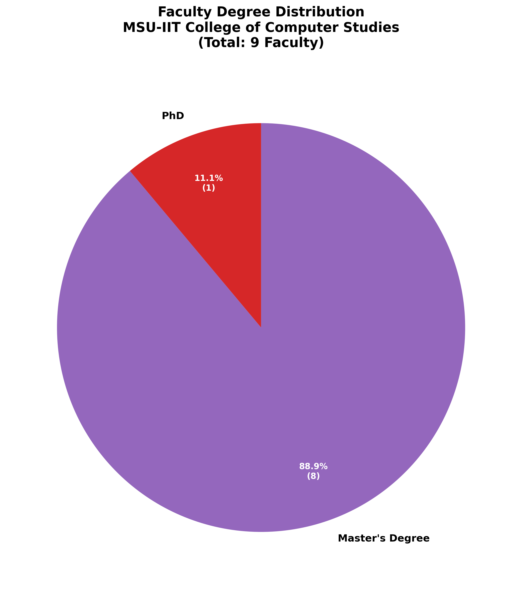
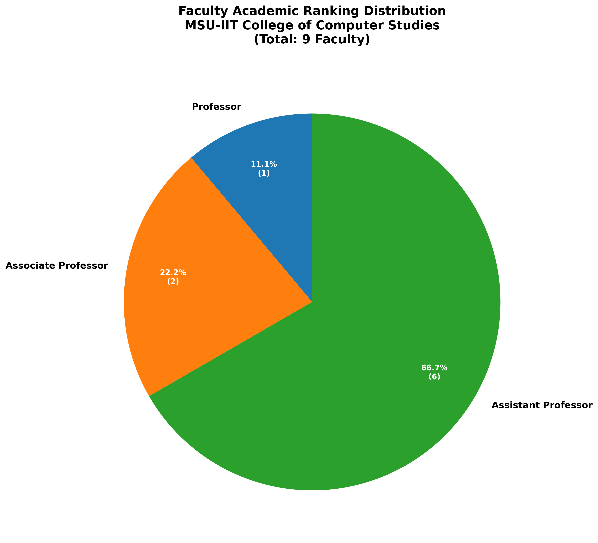

# Well-Defined Objectives

## Institutional Commitment to Faculty Development
MSU-IIT recognizes faculty as its most valuable asset and is committed to providing comprehensive, systematic, and continuous faculty development opportunities that enhance teaching effectiveness, research productivity, and service excellence. The institution's faculty development area is designed to support faculty at all career stages while aligning with institutional strategic goals and national educational priorities.

## Primary Objectives of Faculty Development Area

### Advanced Degree Attainment and Academic Excellence [UPDATE NEEDED: 2021-2025 Data]
- To support faculty in pursuing doctoral and master's degrees in computer science and related fields, with 100% of faculty holding master's degrees, 1 faculty member holding a PhD, 2 faculty having completed academic requirements for PhD, and 2 faculty currently pursuing PhD studies as of 2025.
- To ensure faculty academic qualifications meet CHED CMO No. 25 Series 2015 requirements for BS Computer Science programs
- To maintain faculty rank distribution aligned with AACUP standards with current distribution: 11.1% Professor (1 faculty), 22.2% Associate Professor (2 faculty), 66.7% Assistant Professor (6 faculty)

**References:**
- PPP Pages 3-5: Faculty Profile Matrix showing educational attainment and academic ranks
- PPP Page 5: Charts showing "Highest Degree Earned" and "Academic Rank" distribution
- AACUP Parameter A folder: Academic Qualifications documents
- PPP Page 27: Parameter E Faculty Development degree programs table